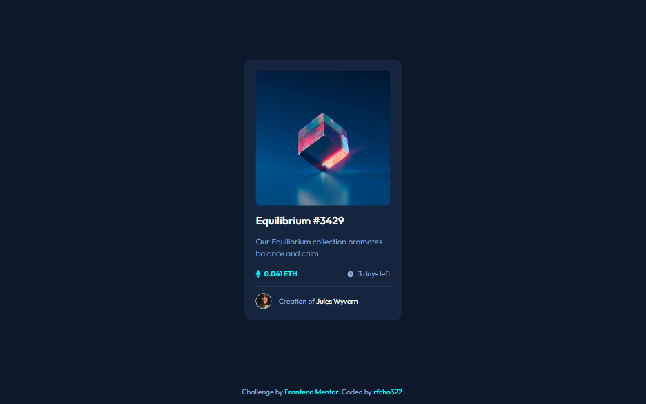
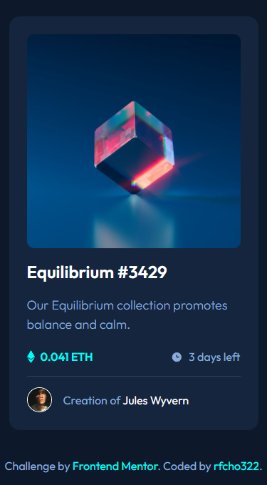

# Frontend Mentor - NFT preview card component solution

This is a solution to the [NFT preview card component challenge on Frontend Mentor](https://www.frontendmentor.io/challenges/nft-preview-card-component-SbdUL_w0U).

## Table of contents

- [Overview](#overview)
  - [The challenge](#the-challenge)
  - [Screenshot](#screenshot)
  - [Links](#links)
- [My process](#my-process)
  - [Built with](#built-with)
  - [Useful resources](#useful-resources)
- [Author](#author)

## Overview

### The challenge

Users should be able to:

- &#9989; View the optimal layout depending on their device's screen size
- &#9989; See hover states for interactive elements

### Screenshot

  <strong>Desktop</strong>

  

  <strong>Mobile</strong>

  

### Links

- Frontend Mentor solution URL: [NFT Card Component Solution](https://www.frontendmentor.io/solutions/nft-card-component-using-scss-bem-and-semantic-html5-markup-vsAYbBVOfX)
- Live Site URL: [NFT Card Component Live Website](https://rfcho322.github.io/fem-nft-card-component/)

## My process

### Built with

- Semantic HTML5 markup
- SCSS
- CSS custom properties
- Flexbox
- CSS Grid
- Mobile-first workflow

### Useful resources

- [sass @function](https://sass-lang.com/documentation/at-rules/function) - This helped me understand how to create a function and return it in sass for complex operations, it's fun using this.
- [sass:math](https://sass-lang.com/documentation/modules/math) - Since I know we can create function in sass, I tried using math module to convert my pixels to rems.

## Author

- Frontend Mentor - [@rfcho322](https://www.frontendmentor.io/profile/rfcho322)
